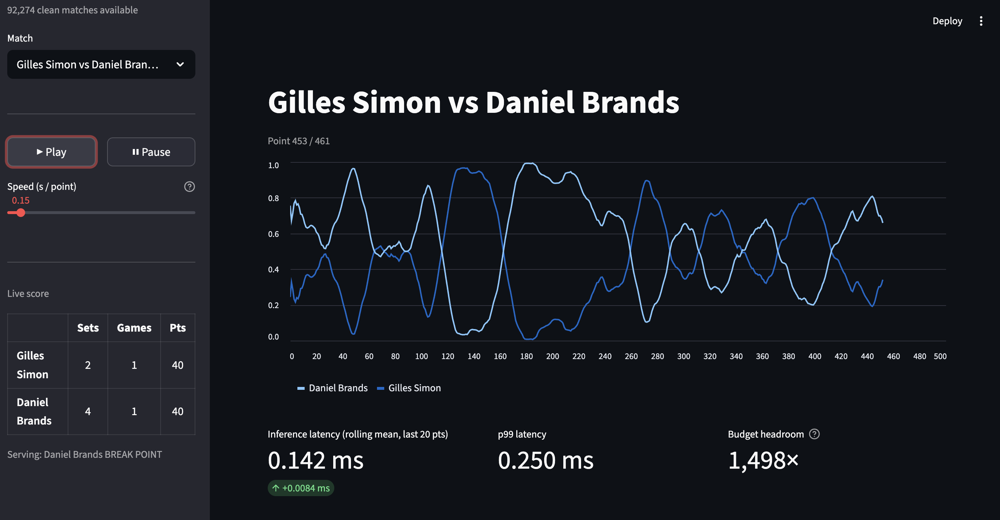

# 🎾 Low-Latency Tennis Betting Simulator

[](https://www.python.org/downloads/)
[](https://docs.astral.sh/uv/)
[](https://xgboost.readthedocs.io/)
[](https://onnxruntime.ai/)
[](https://streamlit.io/)
[](https://optuna.org/)

An end-to-end ML pipeline that takes ATP point-by-point match data, trains an XGBoost classifier exported to ONNX, and streams live set-win probabilities through a hand-built event queue — displayed in a real-time Streamlit dashboard.

The project is built around one specific engineering problem: how do you run a model prediction on every event in a live data stream without the producer and consumer ever blocking each other? The answer is a queue, and once you have the queue, a whole set of design problems follow from it. This project works through each of them concretely.


---

## 🎯 The core problem: two clocks

Every event-streaming system has to reconcile two clocks running at different rates. The world produces events at its own pace (a tennis point every ~20 seconds on average, but bursty). Your compute runs at its own pace (ONNX inference at ~0.009ms per call, ~100,000 events/s theoretical throughput). These two rates are never equal and never stable.

```
WORLD CLOCK                              COMPUTE CLOCK
  t=0s   point played                    t=0.000ms  queue.pop()
  t=20s  next point                      t=0.002ms  state update
  t=22s  next point  ← burst             t=0.011ms  ONNX predict()
  t=23s  next point  ← burst             t=0.013ms  publish
```

The naive approach — call `predict()` synchronously on every arriving event — breaks as soon as the producer bursts. Producer latency becomes equal to consumer latency, and a slow inference call stalls everything upstream. The fix is to put a buffer between the two clocks. That buffer is the queue, and once you have it, the interesting design questions start:

- How does the producer know when the consumer is falling behind?
- What do you do when the buffer fills up?
- How do you safely share the queue between threads?
- How do you maintain the feature vector the model needs without replaying match history on every point?
- Once inference runs, who receives the result? If the consumer returns it directly, any second downstream reader — a risk engine, a logger, an alert system — either competes for the same queue (each event reaches exactly one consumer) or forces you to run inference twice. The output side needs its own decoupling layer: a publisher that any number of subscribers can read independently, without any of them knowing about the others.

These map to concrete decisions in the codebase, one per class.

---

## 🏗️ Architecture

```
ATP CSV data (Jeff Sackmann's tennis_pointbypoint)
        │
        ▼  Phase 1 — Preprocessing
┌───────────────────────────────────────────────────────────────────────┐
│  SackmannLoader → MatchParser → ScoreValidator                        │
│  18,249 matches · 2,820,681 point records · score validation          │
└──────────────────────────────┬────────────────────────────────────────┘
                               │  atp_training_dataset.csv
                               ▼  Phase 2 — Training
┌───────────────────────────────────────────────────────────────────────┐
│  DataSplitter (match-level) → Optuna (20 Bayesian trials)             │
│  → XGBoostTrainer → OnnxExporter                                      │
│  Output: xgb_server_wins.onnx  ·  player_mapping.json                │
└──────────────────────────────┬────────────────────────────────────────┘
                               │  Phase 3 — Ingestion (per point, per match)
┌───────────────────────────────────────────────────────────────────────┐
│                                                                       │
│  MatchEventProducer                                                   │
│  (CSV replay today · Kafka consumer in production)                    │
│          │  MatchEvent (typed dataclass, one per point)               │
│          ▼                                                            │
│  EventQueue  ──── push() returns False when full (backpressure)       │
│  (thread-safe FIFO · max_size=1000 · Prometheus-style metrics)        │
│          │                                                            │
│          ▼                                                            │
│  EventConsumer  (the processing loop that wires everything together)  │
│          │                                                            │
│          ├──► GameStateManager.apply_event()    O(1) delta update     │
│          │    GameStateManager.to_feature_vector()   float32 (1,12)   │
│          │                │                                           │
│          │                ▼                                           │
│          ├──► InferenceEngine.predict()   ~0.009ms   stateless ONNX  │
│          │                │  p_server_wins                            │
│          │                ▼                                           │
│          └──► set_win_probability()   Carter–Pollard two-layer model  │
│                           │  p1_set_win, p2_set_win                   │
│                           ▼                                           │
│               OddsPublisher.publish(OddsUpdate)                       │
│               (in-memory list today · Redis pub-sub in production)    │
│                                                                       │
└──────────────────────────────┬────────────────────────────────────────┘
                               │  Phase 4 — Dashboard
┌───────────────────────────────────────────────────────────────────────┐
│  Streamlit  (one event processed per st.rerun() — actor pattern)      │
│  · rolling set-win probability chart  · live score ticker             │
│  · latency panel: mean, p99, budget headroom  · speed slider          │
└───────────────────────────────────────────────────────────────────────┘
```

---

## 🧱 What each piece solves

### `MatchEventProducer` — the parsing boundary

The producer has one job: convert raw CSV rows into clean, typed `MatchEvent` dataclasses. Everything downstream trusts the shape unconditionally because only one class ever touches raw data. This is the only class that knows about the data source — swapping CSV for a Kafka consumer means changing this file and nothing else. `MatchEvent` stays the same, the queue stays the same, the consumer stays the same.

```python
class MatchEventProducer:
    _POINT_INTERVAL_S: float = 20.0   # avg seconds between tennis points

    def produce(self) -> Iterator[MatchEvent]:
        t0 = time.monotonic()
        for i, row in self._df.iterrows():
            simulated_ts = i * self._POINT_INTERVAL_S * 1000  # ms

            if self._speed > 0:   # speed_factor=0.0 → instant replay (default)
                target_s = t0 + (simulated_ts / 1000.0) / self._speed
                sleep_s = target_s - time.monotonic()
                if sleep_s > 0:
                    time.sleep(sleep_s)

            yield MatchEvent(
                match_id=str(row["match_id"]),
                server=int(row["serving_player"]),
                sets_p1=int(row["sets_p1"]),
                # ... all fields typed and named — no raw dtypes downstream
            )
```

---

### `EventQueue` — decoupling the two clocks

The queue is the design decision that makes everything else possible. Producer calls `push()`, consumer calls `pop()`, and the two never directly interact. When the queue fills up, `push()` returns `False` — an explicit backpressure signal — instead of blocking or silently overflowing.

```python
class EventQueue:
    def push(self, event: MatchEvent) -> bool:
        try:
            self._q.put_nowait(event)   # non-blocking
            with self._lock:
                self._total_pushed += 1
                depth = self._q.qsize()
                if depth > self._peak_depth:
                    self._peak_depth = depth
            return True
        except queue.Full:
            return False                # consumer is lagging — caller decides what to do

    def pop(self, timeout_ms: float = 10.0) -> Optional[MatchEvent]:
        try:
            event = self._q.get(timeout=timeout_ms / 1000.0)
            with self._lock:
                self._total_popped += 1
            return event
        except queue.Empty:
            return None

    def metrics(self) -> dict:
        with self._lock:
            return {
                "total_pushed":  self._total_pushed,
                "total_popped":  self._total_popped,
                "current_depth": self._q.qsize(),
                "peak_depth":    self._peak_depth,
                "drop_count":    self._total_pushed - self._total_popped - self._q.qsize(),
            }
```

For live odds, dropping a stale event is the correct response to backpressure. A bank transaction system would block instead — the choice depends on whether events are substitutable. `metrics()` exposes the same gauges you'd push to Prometheus in production.

One detail worth calling out: the underlying data structure is `queue.Queue`, not `collections.deque`. `deque.append()` and `popleft()` are individually atomic in CPython, but a check-then-act sequence ("if not full, then append") is not — you can overfill it under concurrent access. `queue.Queue` wraps a `threading.Condition` so the size check and the insertion happen atomically. The metric counters still need their own separate `threading.Lock()` since they sit outside `queue.Queue`'s internal locking.

---

### `GameStateManager` — O(1) incremental state

ONNX expects a `(1, 12) float32` array on every call. Events arrive as point-level deltas. Bridging the two naively fails both ways:

- **Recompute from scratch** on every event: O(N) per point, O(N²) across a match — at 155 points that's 24,025 operations and growing.
- **Feed raw `MatchEvent` to ONNX**: it has strings, booleans, player names — ONNX rejects anything that isn't `float32`.

`GameStateManager` keeps a dict of 12 fields and writes only the values that changed per event: 12 dict assignments, O(1). It also maintains exponential moving averages of each player's serve-win rate (`α=0.15`, prior `0.60` which is the ATP average), used by the recursive probability model.

```python
FEATURE_COLS = [
    "player_1", "player_2",      # integer-encoded once at match start
    "sets_p1",  "sets_p2",
    "games_p1", "games_p2",
    "points_p1", "points_p2",
    "serving_player",
    "in_tiebreak", "is_deuce", "is_break_point",
]

class GameStateManager:
    def apply_event(self, event: MatchEvent) -> dict:   # O(1)
        self._state = {
            "player_1":       self._p1_enc,    # encoded once at match start, reused
            "player_2":       self._p2_enc,
            "sets_p1":        event.sets_p1,
            "points_p1":      event.points_p1,
            # ... 12 fields total — no history replayed
            "is_deuce":       int(event.is_deuce),
            "is_break_point": int(event.is_break_point),
        }
        # EMA serve rate: α=0.15 (slow update), prior=0.60 (ATP average)
        if event.server == 1:
            self._ema_p1 = 0.15 * event.server_wins + 0.85 * self._ema_p1
        else:
            self._ema_p2 = 0.15 * event.server_wins + 0.85 * self._ema_p2
        return self._state

    def to_feature_vector(self) -> np.ndarray:          # O(1)
        return np.array(
            [self._state[col] for col in FEATURE_COLS], dtype=np.float32
        ).reshape(1, -1)   # shape (1, 12) — one sample, 12 features
```

In a deployed system this dict lives in Redis. `apply_event()` is a few `HSET` calls. `to_feature_vector()` is a single `HGETALL` at ~0.1ms. A SQL query per inference call would cost ~5ms — 50x slower, compounding across every event of every match.

---

### `InferenceEngine` — stateless ONNX serving

The ONNX session loads in ~10ms at startup and is shared across all matches. `predict()` is a pure function: takes a float32 array, returns a probability and a latency measurement, writes nothing.

```python
class InferenceEngine:
    def __init__(self, model_path: Path) -> None:
        self._session = ort.InferenceSession(str(model_path))  # load once, ~10ms
        self._input_name: str = self._session.get_inputs()[0].name

    def predict(self, fv: np.ndarray) -> tuple[float, float]:
        t0 = time.perf_counter()    # nanosecond resolution
        outputs = self._session.run(None, {self._input_name: fv})
        latency_ms = (time.perf_counter() - t0) * 1000.0

        # outputs[1][0][1]: probability map → sample 0 → class 1 (server wins)
        p_server_wins = float(outputs[1][0][1])
        return p_server_wins, latency_ms
```

```
XGBoost native predict()   ~0.10ms   Python ↔ C++ round-trips, GC pressure
ONNX Runtime predict()     ~0.009ms  direct C++ graph execution, no Python
Speedup: ~11×
```

The `.onnx` file is a self-contained protobuf of the computation graph and weights — you can serve it from Go or Java without touching the Python training environment.

---

### `set_win_probability()` — the recursive probability model

The raw ONNX output is `P(server wins this point)` — a number that oscillates between ~0.55 and ~0.65 as the server alternates every game. Plotting it directly gives you a sawtooth. Betting exchanges price *set* markets, not individual points.

The Carter–Pollard model translates the point-level signal upward in two recursive steps.

**Layer 1 — Point → Game probability:**

```python
def _p_game(p: float, si: int, sj: int) -> float:
    """P(server wins game | server at si pts, returner at sj pts).
    si, sj ∈ {0,1,2,3}  (raw count: 0→0pts 1→15 2→30 3→40)
    """
    if si >= 4: return 1.0
    if sj >= 4: return 0.0
    if si == 3 and sj == 3:             # deuce — closed-form geometric series
        q = 1.0 - p                     # avoids infinite recursion
        return (p * p) / (p * p + q * q)
    return p * _p_game(p, si+1, sj) + (1-p) * _p_game(p, si, sj+1)
```

**Layer 2 — Game → Set probability:**

```python
@lru_cache(maxsize=4096)
def _p_set_memo(gi: int, gj: int, p1_next: bool, pg1_r: int, pg2_r: int) -> float:
    """P(P1 wins set | gi games P1, gj games P2, P1 serves next iff p1_next).
    pg1_r = round(pg1 × 1000) — integer key so the cache actually hits.
    Raw EMA floats are different every call → 0% cache hit rate without rounding.
    """
    pg1 = pg1_r / 1000.0
    pg2 = pg2_r / 1000.0
    if gi >= 6 and gi - gj >= 2: return 1.0
    if gj >= 6 and gj - gi >= 2: return 0.0
    if gi == 7: return 1.0   # tiebreak winner
    if gj == 7: return 0.0
    p1_wins_game = pg1 if p1_next else (1.0 - pg2)
    return (
        p1_wins_game       * _p_set_memo(gi+1, gj,   not p1_next, pg1_r, pg2_r)
        + (1-p1_wins_game) * _p_set_memo(gi,   gj+1, not p1_next, pg1_r, pg2_r)
    )
```

**Composing the two layers** inside `GameStateManager.set_win_probability()`:

```python
class GameStateManager:
    def set_win_probability(self, p_srv: float) -> tuple[float, float]:
        # Layer 1: who wins the current game?
        p_cur_game = _p_game(p_srv, si_pts, sj_pts)
        p1_wins_cur_game = p_cur_game if server == 1 else (1.0 - p_cur_game)

        # EMA serve rates drive all future-game probabilities
        pg1 = _p_game(self._ema_p1, 0, 0)   # P(P1 wins game when P1 serves, from 0-0)
        pg2 = _p_game(self._ema_p2, 0, 0)   # P(P2 wins game when P2 serves, from 0-0)

        # Layer 2: who wins the set given the current games score?
        p1_wins_cur_set = (
            p1_wins_cur_game       * _p_set(gi+1, gj, p1_serves_next, pg1, pg2)
            + (1-p1_wins_cur_game) * _p_set(gi, gj+1, p1_serves_next, pg1, pg2)
        )
        return float(p1_wins_cur_set), float(1.0 - p1_wins_cur_set)
```

The EMA serve rates (not the raw ONNX output) drive all future-game branches — this makes the set-win curve smooth and directional rather than oscillating with every serve change.

---

### `EventConsumer` + `OddsPublisher` — closing the loop

`EventConsumer` is the only class that knows how all the pieces connect. It holds no domain logic — just control flow. But there is a subtlety in how it delivers results.

**The fan-out problem.** If the consumer returned odds directly (as a return value or into a shared variable), any second reader would have to compete for the same data. Pull from the same queue and each event goes to exactly one consumer — the dashboard gets it, the risk engine misses it, or vice versa. Run inference twice to serve both and you've doubled latency and computation. The correct pattern is **publish-subscribe**: the consumer publishes each result once, and any number of subscribers receive every update independently.

```
SINGLE QUEUE (bad fan-out)         PUBLISH-SUBSCRIBE (correct)
  Consumer A ──► pop() ─┐            OddsPublisher.publish(update)
  Consumer B ──► pop() ─┤─► queue          │
  Consumer C ──► pop() ─┘          redis.PUBLISH "tennis.odds"
                                          │
  A, B, C compete — each event      ├──► Dashboard subscribes
  goes to exactly ONE consumer      ├──► Risk engine subscribes
                                    └──► Audit log subscribes
                                    Each gets EVERY update
```

`OddsPublisher` is the output-side counterpart to `EventQueue`. The queue decouples the input; the publisher decouples the output. Consumer writes to it, dashboard reads from it, neither knows about the other.

```python
class EventConsumer:
    def run_match(self, events: list[MatchEvent]) -> pd.DataFrame:
        for event in events:
            t_start = time.perf_counter()       # ← latency clock starts here

            if not self._queue.push(event):
                continue                         # backpressure: drop stale event

            consumed = self._queue.pop(timeout_ms=50.0)
            if consumed is None:
                continue

            self._state.apply_event(consumed)    # O(1) state update
            fv = self._state.to_feature_vector()

            p_server_wins, _ = self._engine.predict(fv)
            p1_point = p_server_wins if consumed.server == 1 else 1.0 - p_server_wins

            p1_sw, p2_sw = self._state.set_win_probability(p_server_wins)

            self._pub.publish(OddsUpdate(
                match_id=consumed.match_id,
                point_index=consumed.point_index,
                p1_win_prob=p1_point,
                p2_win_prob=1.0 - p1_point,
                p_server_wins=p_server_wins,
                latency_ms=(time.perf_counter() - t_start) * 1000.0,  # ← stops here
                p1_set_win=p1_sw,
                p2_set_win=p2_sw,
            ))

        return self._pub.to_dataframe()
```

In production `publish()` is a single `redis.PUBLISH("tennis.odds", update.to_json())` call. The dashboard subscribes to the same Redis channel and receives a push notification instead of polling on `st.rerun()`. Adding a risk engine or an audit logger means adding one more Redis subscriber — zero changes to the inference pipeline.

```python
class OddsPublisher:
    def publish(self, update: OddsUpdate) -> None:
        self._history.append(update)    # production: redis.publish("tennis.odds", ...)

    def to_dataframe(self) -> pd.DataFrame:
        return pd.DataFrame([
            {"point_index": u.point_index, "p1_set_win": u.p1_set_win,
             "p2_set_win":  u.p2_set_win, "latency_ms": u.latency_ms, ...}
            for u in self._history
        ])
```

---

### The dashboard — one event per frame, no threads

Streamlit re-renders the entire page every time `st.rerun()` is called. The dashboard exploits this to build a streaming loop without any background threads: each re-render is one tick of the event loop.

The key constraint Streamlit imposes is that **all state must survive re-renders**. Local variables don't — they reset every time the page redraws. `st.session_state` is the persistent store, the equivalent of actor state in the actor model.

**Startup (runs once):** The ONNX session, the CSV data, the match catalogue, and the player mapping are expensive to load (~500 ms total). They are created only if absent from `st.session_state`, so they survive every subsequent re-render:

```python
if "pipeline" not in st.session_state:
    config = IngestionConfig(processed_csv=..., model_path=..., ...)
    st.session_state["pipeline"]  = IngestionPipeline(config)   # ONNX + CSV
    st.session_state["engine"]    = pipeline._engine             # shared session
    st.session_state["catalogue"] = _build_catalogue(pipeline)   # match list
```

**Match selection:** When the user picks a match, all events for that match are pre-loaded into an `EventQueue` stored in `st.session_state`. A fresh `GameStateManager` and `OddsPublisher` are also created and stored. Heavy objects (engine, pipeline) are untouched.

**The tick loop:** When `running` is `True`, each re-render pops exactly one event from the queue, runs the full pipeline, publishes one `OddsUpdate`, then sleeps `tick_delay` seconds and calls `st.rerun()` to trigger the next frame:

```python
# app.py — one event per re-render (the tick)
if st.session_state.get("running"):
    ev = st.session_state["queue"].pop(timeout_ms=0)
    if ev is not None:
        st.session_state["state_manager"].apply_event(ev)
        fv          = st.session_state["state_manager"].to_feature_vector()
        p_srv, lat  = st.session_state["engine"].predict(fv)
        p1_sw, p2_sw = st.session_state["state_manager"].set_win_probability(p_srv)
        st.session_state["publisher"].publish(OddsUpdate(...))
        st.session_state["current_event"] = ev

time.sleep(tick_delay)   # let the browser paint this frame before the next
st.rerun()               # ← schedules the next tick
```

**Render:** After the tick, `OddsPublisher.to_dataframe()` is called and the whole chart is redrawn from scratch. The chart grows by one point per frame. The score ticker reads `current_event` directly.

```
Each st.rerun() call:

  [read st.session_state]
         │
         ▼  (one event)
  queue.pop()
  state.apply_event()
  engine.predict()
  publisher.publish()
         │
         ▼
  odds_df = publisher.to_dataframe()   ← full history, redrawn
  st.line_chart(smoothed)              ← chart grows by 1 point
  st.markdown(score_ticker)            ← score updates
         │
         ▼
  time.sleep(tick_delay)
  st.rerun()                           ← triggers next frame
```

This is exactly the **actor pattern**: each re-render reads current state, performs one deterministic computation, writes updated state, and schedules itself again. No threads, no callbacks, no shared mutable state — the GIL is never a concern.

---

## 📊 Latency

```
Stage                         mean      p99
─────────────────────────────────────────────
queue push + pop              0.002ms   0.004ms
state.apply_event()           0.003ms   0.006ms
state.to_feature_vector()     0.002ms   0.004ms
engine.predict()  ← ONNX     0.009ms   0.013ms   dominant
set_win_probability()         0.001ms   0.002ms
publisher.publish()           0.001ms   0.002ms
─────────────────────────────────────────────
total                         0.018ms   0.031ms

Budget (production SLA):   200ms
Headroom:                  200 / 0.018 ≈ 11,000×
```

The headroom exists to absorb what replay doesn't simulate: network round-trips, Redis writes, Python GC pauses, OS scheduling jitter. The architecture decisions — O(1) state, ONNX, explicit backpressure — are what create the headroom to spend.

---

## ⚠️ What this doesn't model

Some production complexities are out of scope. Worth naming them so the simplifications are visible:

| Complexity | Production | This project |
|---|---|---|
| **Delivery guarantees** | Kafka transactions, idempotent producers | At-most-once (drop on backpressure) |
| **Fault tolerance** | Resume from last committed Kafka offset | Restart from beginning |
| **Schema evolution** | Avro schemas with backward/forward compat | Renaming a dataclass field breaks everything |
| **Late events** | Event-time watermarks (Flink, Spark Streaming) | CSV replay is perfectly ordered |
| **Multi-match parallelism** | One consumer thread per Kafka partition | `run_all()` iterates sequentially |

---

## 🚀 Quick Start

Requires Python 3.11+ and [uv](https://docs.astral.sh/uv/).

```bash
git clone https://github.com/draperkm/low-latency-betting.git
cd low-latency-betting
uv sync
```

Download [Jeff Sackmann's tennis_pointbypoint data](https://github.com/JeffSackmann/tennis_pointbypoint) and place the `pbp_matches_*.csv` files under `data/data_download/training/raw/tennis_pointbypoint/`.

```bash
# Phase 1 — parse 18K matches → 2.8M point records
uv run python -m tennis_predictor.preprocessing

# Phase 2 — Optuna tuning + XGBoost + ONNX export
uv run python -m tennis_predictor.training

# Phase 3 — smoke test: replay one match, print latency stats
uv run python -m tennis_predictor.ingestion
# → mean: 0.009ms | p99: 0.013ms | headroom: 11,000×

# Phase 4 — dashboard
uv run streamlit run src/tennis_predictor/dashboard/app.py
# open http://localhost:8501 · pick a match · press Play
```

---

## 🔧 Stack

| Component | Technology | Why |
|---|---|---|
| Package manager | uv | Lock-file based, fast |
| Classifier | XGBoost 2.0+ | Native categorical support, fast training |
| Hyperparameter search | Optuna | Bayesian optimisation, prunes bad trials early |
| Model serving | ONNX Runtime | ~11× faster than native `predict()`, framework-agnostic |
| Dashboard | Streamlit | Actor-pattern event loop, no threads needed |
| Probability model | Carter–Pollard recursion | Point → game → set, analytically correct |

---

## 📄 Data

Point-by-point match records from [Jeff Sackmann's tennis_pointbypoint](https://github.com/JeffSackmann/tennis_pointbypoint). Not included in this repo — download and place under `data/data_download/training/raw/tennis_pointbypoint/`.

---

**Jean Charles** · [LinkedIn](https://www.linkedin.com/in/jean-charles-k/) · [GitHub](https://github.com/draperkm)
